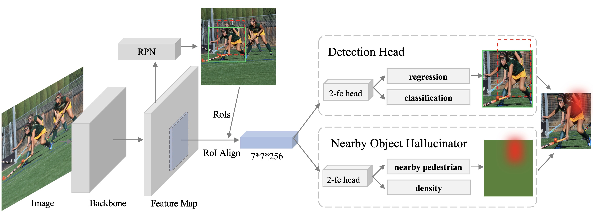
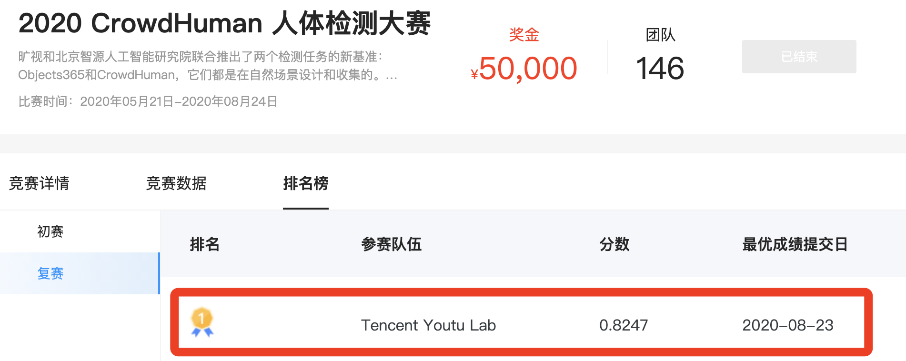

# NOH-NMS: Improving Pedestrian Detection by Nearby Objects Hallucination

<div align="center">
  
</div>

The offical implementation for the ["NOH-NMS: Improving Pedestrian Detection by Nearby Objects Hallucination"](https://arxiv.org/pdf/2007.13376.pdf) which is published in **ACM MM 2020**. 

We propose Nearby Objects Hallucinator (NOH), which pinpoints the objects nearby each proposal with a Gaussian distribution, together with NOH-NMS, which dynamically eases the suppression for the space that might contain other objects with a high likelihood.

This work has won the **first place** at the [CrowdHuman Challenge, 2020](http://competition.baai.ac.cn/c/34/rank/timeline/68?sourceType=public).

<div align="center">
  
</div>

* This repo is implemented based on [detectron2](https://github.com/facebookresearch/detectron2).

## Performance
|    Model    | Backbone |  AP  |  Recall |  MR  |  
|-------------|----------|------|---------|------| 
| Faster RCNN | ResNet-50| 85.0 |   87.5  | 44.5 |
|   NOH-NMS   | ResNet-50| 88.8 |   92.6  | 43.7 |

* We provide the weights of Faster RCNN and NOH-NMS in [here](https://1drv.ms/u/s!Av_kGG3Ke7utap2fqTsHh-Bs9Os?e=9Rrd87).

## Prepare Datasets
Download the CrowdHuman Datasets from http://www.crowdhuman.org/, and then move them under the directory like:
```
./data/crowdhuman
├── annotations
│   └── annotation_train.odgt
│   └── annotation_val.odgt
├── images
│   └── train
│   └── val
```

## Installation
```
  cd detectron2
  pip install -e . 
  #or rebuild
  sh build.sh
```

## Quick Start
See [GETTING_STARTED.md](GETTING_STARTED.md) in detectron2

## Acknowledgement
* [detectron2](https://github.com/facebookresearch/detectron2)

## Citation
if you find this project useful for your research, please cite:
```
@inproceedings{zhou2020noh,
  title={NOH-NMS: Improving Pedestrian Detection by Nearby Objects Hallucination},
  author={Zhou, Penghao and Zhou, Chong and Peng, Pai and Du, Junlong and Sun, Xing and Guo, Xiaowei and Huang, Feiyue},
  booktitle={Proceedings of the 28th ACM International Conference on Multimedia},
  pages={1967--1975},
  year={2020}
}
```
